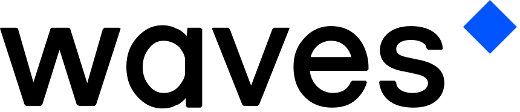

Waves to oparty na społeczności stos zdecentralizowanych technologii open-source do budowania skalowalnych, przyjaznych dla użytkownika aplikacji.

**Szybki, tani i przyjazn dla środowiska**

Waves uruchomiony w 2016 roku, jest globalną platformą open-source dla zdecentralizowanych aplikacji. Oparty na konsensusie proof-of-stake, Waves aspiruje do maksymalnego wykorzystania blockchaina, przy minimalnym śladzie węglowym.

Stos technologiczny Waves może przynieść korzyści w każdym przypadku użycia, który wymaga bezpieczeństwa i decentralizacji - otwarte finanse, identyfikacja osobista, gry, wrażliwe dane i wiele innych.

**Czym jest protokół Waves?**\
\
Waves to platforma blockchain, która ma na celu ułatwić budowanie zdecentralizowanych aplikacji Web 3.0 i uruchomienie inteligentnych aktywów opartych na blockchain.\
\
W skrócie:
- Waves to platforma blockchain zbudowana do uruchamiania inteligentnych kontraktów i inteligentnych aktywów. 
- Powstała w 2016 roku i od tego czasu utrzymuje się w pierwszej setce najpopularniejszych kryptowalut. 
- Waves Exchange i Neutrino Protocol to dwie z najbardziej udanych platform zbudowanych na protokole Waves.\
\
Pomimo istnienia dosłownie setek różnych implementacji blockchain, tylko nielicznym udało się osiągnąć właściwą równowagę pomiędzy dostępnością, zestawem funkcji i użytecznością.
Waves jest jednym z wyjątków, podejmując uczciwe podejście do wszystkich trzech z jego ultra przyjaznym dla użytkownika blockchain.\
\
**Co to jest Waves?**\
\
Waves to platforma blockchain, która ułatwia tworzenie niestandardowych tokenów kryptowalutowych (zwanych inteligentnymi aktywami) i uruchamianie inteligentnych kontraktów, które zasilają szereg zdecentralizowanych aplikacji (dapps).\
\
**Czy wiesz, że?**\
\
Dapp to aplikacja, która działa na blockchainie. Popularne dapps obejmują zdecentralizowane giełdy, gry i platformy pożyczek bez zaufania.
Te inteligentne aktywa mogą reprezentować praktycznie wszystko, w tym aktywa świata rzeczywistego i inne kryptowaluty, i mogą być kupowane, sprzedawane, używane i wymieniane w ekosystemie Waves.
Od zakończenia początkowej oferty monet (ICO) w kwietniu 2016 r. i uruchomienia kilka miesięcy później, Waves urósł do rangi jednej ze 100 najbardziej udanych kryptowalut, a obecnie ma kapitalizację rynkową w wysokości prawie 2,5 miliarda dolarów.\
\
**Jak działa Waves?**\
\
Podobnie jak większość kryptowalut, Waves działa na zdecentralizowanej księdze zwanej blockchain. Jest on zabezpieczony przez nowatorski mechanizm konsensusu znany jako Leased Proof of Stake (LPoS), który jest zasadniczo zmodyfikowaną wersją proof-of-stake (PoS), która pozwala użytkownikom portfeli na pomoc w uczestniczeniu w procesie walidacji bloku poprzez dzierżawę swoich tokenów WAVES węzłom wydobywczym (węzeł lite to rodzaj portfela kryptowalutowego, który nie musi pobierać całego blockchaina do działania - w przeciwieństwie do pełnego węzła).
Dzierżawiąc WAVES węzłowi górniczemu, użytkownicy ci zarabiają ułamek nagrody za blok, jeśli wybrany przez nich węzeł zostanie wybrany jako jego walidator.\
\
Duża część mocy Waves pochodzi z jego Smart Assets, które są zasadniczo tokenami, które mają dodatkową funkcjonalność dzięki skryptom aktywów. Mogą one nadać tym „Smart Assets” szereg interesujących cech, takich jak brak możliwości przenoszenia, jeśli osiągnie określony adres (spalony) lub zamrożenie, gdy blockchain Waves osiągnie określoną wysokość bloku.
Stworzenie Smart Asset na Waves jest tak proste, jak użycie funkcji 'Issue Transaction', ustawienie kilku podstawowych parametrów i uiszczenie opłaty w wysokości 1 WAVES za uruchomienie tokena z Twojego konta.\
\
**Czym Waves wyróżnia się od reszty?**

- Wysoka przepustowość - niedawno uruchomiony mainnet Waves-NG jest w stanie obsłużyć około 100 transakcji na sekundę (tps), w porównaniu do maksymalnie 7 tps dla Bitcoina. 
- Niskie opłaty transakcyjne - mogą one wynosić już od 0,001 WAVES dla zwykłych transakcji lub 0,005 WAVES dla transakcji wywołujących skrypt. 
- Ultra inclusive - mechanizm konsensusu Waves' Leased Proof of Stake (LPoS) zapewnia, że każdy, kto posiada tokeny WAVES może zarabiać nagrody poprzez dzierżawę swoich tokenów węzłom wydobywczym.
- Inteligentne tokeny - inteligentne tokeny Waves mogą być uruchomione przez każdego, ponieważ nie jest wymagane doświadczenie w programowaniu. Stworzenie tokena na Waves jest tak proste, jak kilka kliknięć przycisku.

**Czy wiesz, że?**\
\
Ethereum jest prawdopodobnie największym konkurentem Waves, ponieważ jest to najpopularniejsza platforma do wprowadzania tokenów na rynek.\
\
**Co można zrobić z Waves?**\
\
Jak już wcześniej wspomniano, platforma Waves może być wykorzystywana do budowania i uruchamiania złożonych zdecentralizowanych aplikacji (dApps), które można zaprojektować wokół praktycznie każdego przypadku użycia.
Według stanu na grudzień 2021 roku, najpopularniejsze dApps to protokół Neutrino, AMM SwopFi oraz ViresFinance. 
Blochchain Waves napędza również Metaverse NFT WavesDucks oraz NFT gallery Sign-Art. Wymienione protokoły zostaną omówione w kolejnych materiałach.
25 listopada zakończyło się IDO (Initial Dex Offering) złożonego protokołu AMM związanego z tokenem WX, który min. będzie pomagał w zdecentralizowanej administracji protokołu.

Waves token ma również kilka innych funkcji, ale obecnie jest najczęściej używany do handlu na platformie WavesExchange oraz na scentralizowanych platformach wymiany innych firm.\
\
**Gdzie i jak kupić Waves**\
\
Jako jeden ze starszych altcoinów, Waves jest już dostępny do zakupu i handlu na ponad 100 różnych platformach.
Prawdopodobnie najprostszym sposobem na zakup WAVES jest skorzystanie z opcji zakupu proponowanej przez Waves.Exchange lub zakup poprzez giełdę KuCoin. Jedną z popularnych form zakupu jest również skorzystanie z serwisu Crypto.com, w którym jest również możliwość uzyskania karty debetowej Visa.
Dokładny proces kupna zostanie omówiony w kolejnych materiałach.\
\
**Przyszłość**\
\
Niektóre z nadchodzących aktualizacji dla platformy obejmują rozwinięcie funkcjonalności jednostek gWX. Jednostki te będą pełniły funkcję siły głosu w zdecentralizowanej administracji WavesExchange. Podobne rozwiązania zostaną  wprowadzane w pozostałe DeFi: SwopFi, ViresFinance oraz Neutrino. Z zapowiadanych zmian i aktualizacji wynika, że większość 2022 roku będzie skupiona na rozwoju tego typu funkcjonalości. 
W opublikowanej „road” mapie na kolejny rok znajduje się min.:

- Poprawa nowych funkcjonalności wprowadzonych w ostatnim kwartale 2021
- Rozwój giełdy o kolejne tokeny z łańcuchów Ethereum, Binance i Polygon
- Wprowadzenie funkcji Stop-Loss i Take-Profit
- Implementacja NFT marketplace
- Możliwość wykorzystania „order book pools” w prostych swap ‘ach.
- Nowe możliwości arbitrażu z wykorzystaniem dApp-to-dApp calls
- Zdecentralizowany, agnostyczny serwis wymiany tokenów pomiędzy różnymi łańcuchami bloków
- Wprowadzenie rynku instrumentów pochodnych (derywat)
- Rozwój kolejnych projektów dApp i DeFi

**Napędzany przez DAO**

Technologie Waves są wspierane przez Waves Association - berlińską organizację non-profit, która promuje badania nad Waves, edukację i zapewnia granty dla projektów opartych na stosie Waves. Ani kontrola, ani prowadzenie nie leżą w rękach stowarzyszenia - Waves jest budowany i utrzymywany przez społeczność.

Aby dowiedzieć się więcej o stowarzyszeniu, odwiedź stronę: [https://wavesassociation.org](https://wavesassociation.org)